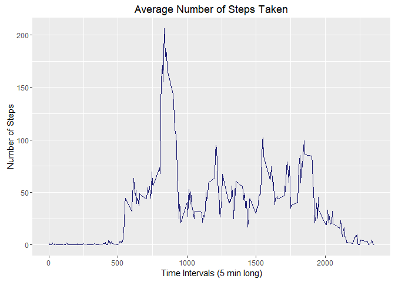
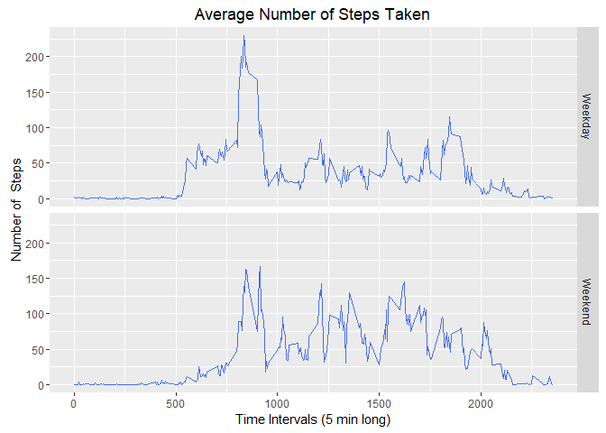

## Reproducible Research: Course Project 1

It is now possible to collect a large amount of data about personal movement using activity monitoring devices such as a Fitbit, Nike Fuelband, or Jawbone Up. These type of devices are part of the "quantified self" movement - a group of enthusiasts who take measurements about themselves regularly to improve their health, to find patterns in their behavior, or because they are tech geeks. But these data remain under-utilized both because the raw data are hard to obtain and there is a lack of statistical methods and software for processing and interpreting the data.

This assignment makes use of data from a personal activity monitoring device. This device collects data at 5 minute intervals through out the day. The data consists of two months of data from an anonymous individual collected during the months of October and November, 2012 and include the number of steps taken in 5 minute intervals each day.

Dataset: [Activity Data](https://d396qusza40orc.cloudfront.net/repdata%2Fdata%2Factivity.zip)

Data Variables:

 * __steps__: Number of steps taking in a 5-minute interval (missing values are coded as __NA__)
 * __date__: The date on which the measurement was taken in YYYY-MM-DD format
 * __interval__: Identifier for the 5-minute interval in which measurement was taken
 
***
 
### Reading and Processing the Data

First read in the libraries that we'll need for the analyses.

```r
library(ggplot2)
library(dplyr)
```

We want to read the data in from the URL and process out the NAs since we're not interested in the cases that have missing values for the steps data.


```r
# Download the data and read it in
URL <- "http://d396qusza40orc.cloudfront.net/repdata%2Fdata%2Factivity.zip"
download.file(URL, "activityData.zip", mode = "wb")
unzip("activityData.zip")
data <- read.csv("activity.csv")

# Extract out the rows that have no NA values (complete cases)
index <- complete.cases(data)
dataComplete <- data[index, ]
summary(dataComplete)
```

```
##      steps                date          interval     
##  Min.   :  0.00   2012-10-02:  288   Min.   :   0.0  
##  1st Qu.:  0.00   2012-10-03:  288   1st Qu.: 588.8  
##  Median :  0.00   2012-10-04:  288   Median :1177.5  
##  Mean   : 37.38   2012-10-05:  288   Mean   :1177.5  
##  3rd Qu.: 12.00   2012-10-06:  288   3rd Qu.:1766.2  
##  Max.   :806.00   2012-10-07:  288   Max.   :2355.0  
##                   (Other)   :13536
```

***

### What is mean total number of steps taken per day?

Now we want to know the distribution of total daily steps taken over the whole data period.


```r
# Calculate the total number of steps taken per day
dataDates <- aggregate(dataComplete$steps, by = list(dataComplete$date), FUN = sum)
names(dataDates)[1] <- "date"
names(dataDates)[2] <- "steps"

# Histogram of the total number of steps taken each day
ggplot(dataDates, aes(x = steps)) +
  geom_histogram(fill = I("midnightblue"), col = I("white"), binwidth = 1000) +
  labs(title = "Daily Steps Taken", x = "Daily Steps", y = "Frequency") +
  scale_y_continuous(limits=c(0, 10), breaks = seq(0,10,2))
```

<!-- -->

As we see from the histogram, the most frequent daily step count falls between 10,000 and about 14,000 steps, which happened on 7 to 9 days during the tracking period. What's the mean and median number of steps for this data set?


```r
mean(dataDates$steps)
```

```
## [1] 10766.19
```

```r
median(dataDates$steps)
```

```
## [1] 10765
```

***

### What is the average daily activity pattern?


```r
# Average the intervals across all days
dataIntervals <- aggregate(steps ~ interval, data = dataComplete, FUN = mean)

# Plot of the interval steps
ggplot(dataIntervals, aes(x = interval, y = steps)) +
  geom_line(col = "midnightblue") +
  labs(title = "Average Number of Steps Taken", x = "Time Intervals (5 min long)", y = "Number of Steps")
```

<!-- -->

Let's see which 5-minute interval, across all days, contains the maximum number of steps.


```r
# Calculate maximum number of steps and what interval they're in
maxSteps <- max(dataIntervals$steps)
dataIntervals[which(dataIntervals$steps == maxSteps), ]
```

```
##     interval    steps
## 104      835 206.1698
```

***
 
### Imputing missing values

Going back to our pre-processed data, there were a number of NAs in the dataset. How many exactly?


```r
sum(is.na(data$steps))
```

```
## [1] 2304
```

That's a lot of missing values. We need to devise a strategy to fill in these NAs with values. Let's use the average of the 5-minute time interval for each NA value. We'll need the `dplyr` library for this.


```r
# Replace NAs with the mean of the steps along the interval
dataFilled <- data %>% 
  group_by(interval) %>%
  mutate(steps = replace(steps, is.na(steps), mean(steps, na.rm=TRUE))) %>%
  as.data.frame()
```

```
## Warning: package 'bindrcpp' was built under R version 3.3.3
```

We're going to look at the distribution of total daily steps taken over the whole data period again now that we have replaced the missing values.


```r
# Calculate the total number of steps taken per day
dataDatesNew <- aggregate(dataFilled$steps, by = list(dataFilled$date), FUN = sum)
names(dataDatesNew)[1] <- "date"
names(dataDatesNew)[2] <- "steps"

# Histogram of the total number of steps taken each day
ggplot(dataDatesNew, aes(x = steps)) +
  geom_histogram(fill = I("royalblue2"), col = I("white"), binwidth = 1000) +
  labs(title = "Daily Steps Taken", x = "Daily Steps", y = "Frequency") +
  scale_y_continuous(limits = c(0, 15), breaks = seq(0,15,2))
```

<!-- -->

What's the mean and median number of steps for this data set now that we replaced the missing values?


```r
mean(dataDatesNew$steps)
```

```
## [1] 10766.19
```

```r
median(dataDatesNew$steps)
```

```
## [1] 10766.19
```

The values differ only very slightly, with the mean being the same and the median only a little bit different.

***

### Are there differences in activity patterns between weekdays and weekends?

First we must create a few extra columns describing the days of the week for this data set.


```r
# Figure out the day of the week
dataFilled$DayofWeek <- weekdays(as.Date(dataFilled$date))

# Add an additional column noting if it's a weekday or weekend
dataFilled$DayType <- ifelse(dataFilled$DayofWeek == "Saturday" | dataFilled$DayofWeek == "Sunday", 
                             "Weekend", "Weekday")
```

Now we want to compare our daily pattern on a weekday to the one on a weekend.


```r
# Average the intervals across all days
dataIntervalsNew <- aggregate(steps ~ interval + DayType, data = dataFilled, FUN = mean)

# Plot of the interval steps based on Weekday or Weekend
ggplot(dataIntervalsNew, aes(x = interval, y = steps)) +
  geom_line(col = "royalblue2") + facet_grid(DayType ~.) +
  labs(title = "Average Number of Steps Taken", x = "Time Intervals (5 min long)", y = "Number of  Steps")
```

<!-- -->

We do see some differences, such as an earlier and bigger activity spike in the morning (perhaps a work commute) on the weekdays.
